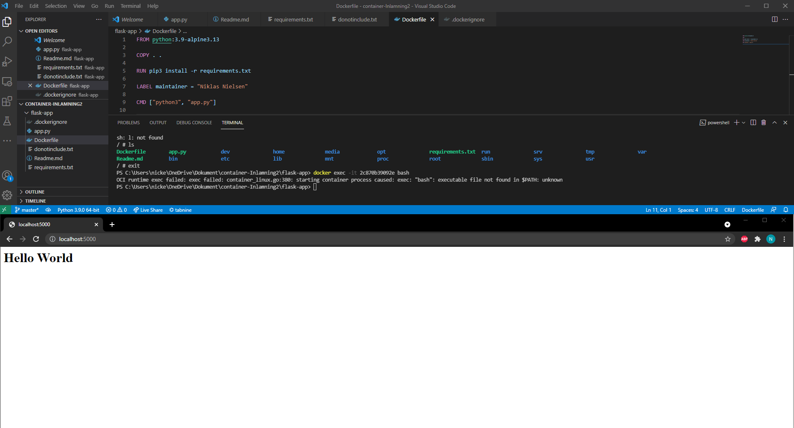
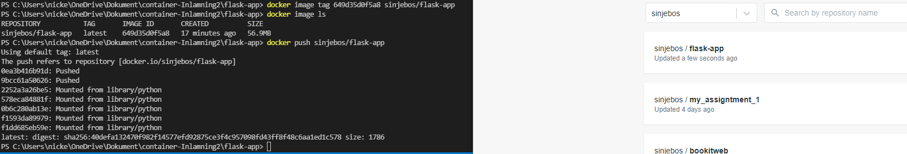
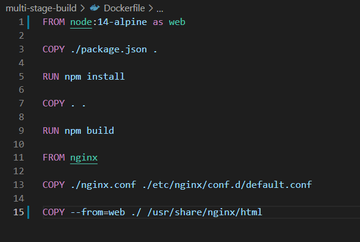
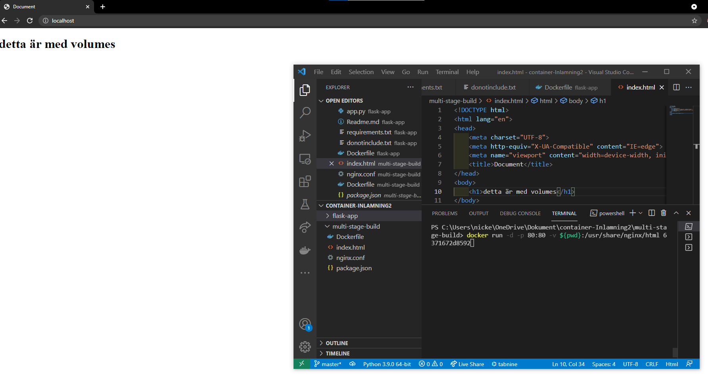
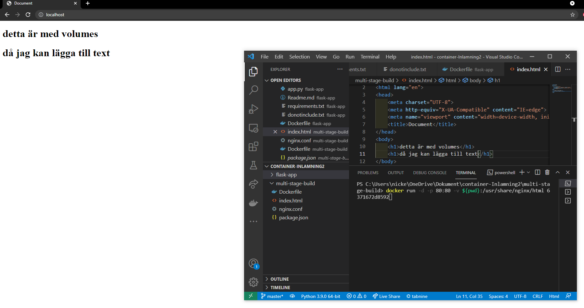

# Container-Teknologi inlämning 2 #
- [Docker-compose](#Docker-compose)
- [Flask-app](#Flask-app)
- [Multi-Stage-Build](#Multi-Stage-Build)
- [Mysql-Persistent-Data](#Mysql-Persistent-Data)
- [Frågor](#Frågor)

## Docker-compose

```yaml
version: "3.8"          - Specificerar vilken version av Docker-compose
services:               - tillåter att köra tjänster under detta
 flask:                 - Namnet på första servicen, kan heta vad som
  container_name: flaskcontainer  - Ger containern namnet "flaskcontainer"
  build:                - Här specifieras att docker-compose ska börja bygga
    context: ./app      - Vilken fil docker-compose skall titta i för hitta sin Dockerfile
   dockerfile: Dockerfile.dev - pga att Docker filen inte heter bara "Dockerfile" så behövs det specifieras 
  ports:                - tillåter att öppna portar
   - "5000:5000"        - Gör så ens lokala lyssnar på port 5000 och containern lyssnar på 5000
  depends_on:           - Specifierar att db skall byggas först
   - db
  networks:             - Ger "flask" nätverket flask_app_net
    - flask_app_net
 db:                    - namn på andra servicenn
  container_name: dbcontainer   - Ger containern namnet "dbcontainr"
  image: postgres:latest        - hämtar senaste postgres image från dockerhub
  restart: always               - startar alltid om containern om den stannar
  environment:                  - variabler
   POSTGRES_DB: mydb            - db namn i postgres
   POSTGRES_PASSWORD: postgres  - lösenord till postgres
   POSTGRES_USER: postgres      - användarnamn till postgres
  volumes:  - länkar lokala files "postgres_data" till containern
   - postgres_data:/var/lib/postgresql/data/
  networks: - Ger "db" nätverket flask_app_net
   - flask_app_net
       
networks:  - nätverk
  flask_app_net:  - namnet på nätverket
      driver: bridge  - vilken bridge den skall ha

volumes:        - skapar lokal volume
 postgres_data: - namnet på lokala volume
```
# Del 2 praktiskt #

## Flask-app ##

Började med att skapa alla filer och sedan kopiera in allt som skulle med som kod till app.py och flask==2.0.1 till requirements.txt.
Skapade sedan Dockerfile efter vad som behövdes till att köra app.py koden

Körde sedan docker kommandon för att bygga imagen och starta containern
```python
Docker build -p 5000:5000 -t sinjebos/flask-app .
Docker image ls
Docker container run <image id>
```
Och besökte sedan localhost:5000 för att se "Hello World" som bilden nedan



Efter allt funkade och fick upp "hello world" så gjorde jag
```python
docker push <image name>
```



## Multi-Stage-Build

Här börja jag med att skapa Dockerfile och använda mig utav Node då jag jobbat med det som mest.








## Mysql-Persistent-Data


# Del 3 Projekt


# Frågor

1. [x] Vad är Docker(plattformen)?


2. [x] Vad är en Docker Image och hur relaterar en sådan till Docker Containers?


3. [x] Vad innebär containerteknologi?


4. [x] Vad är Docker Registry?


5. [x] Hur lyder Docker Linux Kernels arbetsbeskrivning (vad den gör och hur det går till)?


6. [x] På vilket sätt kan Docker och Docker Containers jämföras med fartygstransporter?


7. [x] - Vad händer när vi har en Dockerfile och kör "docker build ."? Gå igenom build-processen